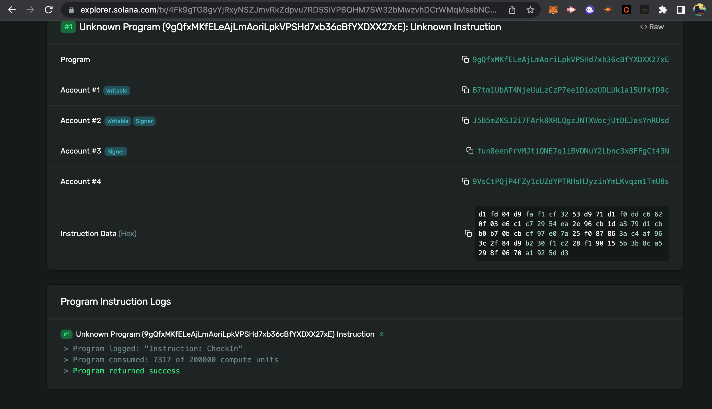
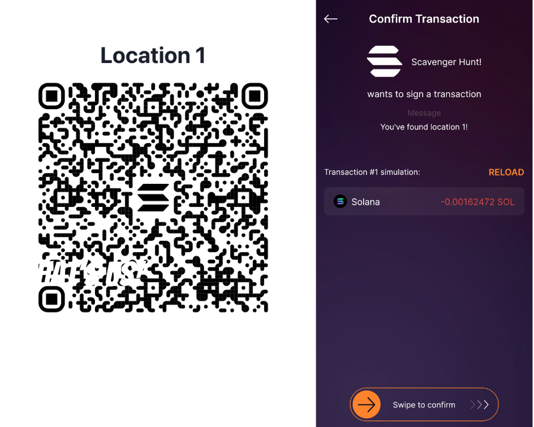

# Solana Pay

# Lesson Objectives

_By the end of this lesson, you will be able to:_

-   Use the Solana Pay specification to build payment requests and initiate transactions using URLs encoded as QR codes
-   Use the `@solana/pay` library to help with the creation of Solana Pay transaction requests
-   Partially sign transactions and implement transaction gating based on certain conditions


# TL;DR
<!-- Can we ELI5 here and put it in "non-dev" speak? -->
<!-- Adjusted spacing between -->
-   **Solana Pay** in order for a transaction on the Solana Network to take place, it requires a certain structure to ensure things like security and speed. This tool helps us build and submit the transactions with the required structure.
    
-   **Partial signing** of transactions allows for the creation of transactions that require multiple signatures before they are submitted to the network. Think of this as signing a check and letting your friend fill out the rest before they sign the back and deposit it in their account.
    
-   **Transaction gating** involves implementing rules that determine whether certain transactions are allowed to be processed or not, based on certain conditions or the presence of specific data in the transaction.

# Overview

In this lesson, you will learn how to create transaction requests with the Solana Pay specification and how to encode the request as a QR code. You will also be introduced to partial transaction signing and transaction gating, which allows you to set rules for processing transactions based on specific conditions. The overview and demonstration will show you how to do this using Nextjs.
<!-- What is the app we are building that will do this?-->
In the end, you will have completed the build for a Scavenger Hunt App that requires a user to Scan QR Codes/Sign the transactions in chronological order (Location 1 -> 2 -> 3).

# What's Needed to Start?

We will be providing boiler-plate code to get started, but some previous Javascript and React experience is always useful! We will also be using some Rust, but no worries if you unfamiliar, we provide plenty of comments to help you understand.

You will need to install `ngrok`, which you can set up [here](https://ngrok.com/).

Or, if on a Mac use [Homebrew](https://formulae.brew.sh/cask/ngrok) 

`brew install --cask ngrok` 

Also, have a mobile device ready with Solflare available to test our Front-End. This demo works best with Solflare (Phantom wallet will display a warning message when scanning a Solana Pay QR code).

## Solana Pay

The Solana Pay specification is a set standards that allow users to request payments and initiate transactions using URLs in a uniform way across various Solana apps and wallets.

There are two types of requests defined by the Solana Pay specification:
<!-- Not super clear on the difference b/t the 2 -->
1. Transfer Request: used for simple SOL or SPL Token transfers.
2. Transaction Request: used to requests any type of Solana transaction, like updating a smart contract (also called a program) on the Solana blockchain.

In this lesson, we will focus on Transaction Requests which enables developers to build a wide range of transactions.

### Solana Pay transaction request

The Solana Pay transaction request allows a wallet to request and execute any type of Solana transaction using a standardized URL. For our build, we will be reading and updating a program on-chain as well as transfering SOL if needed.
<!-- Example URL? -->
URL Ex: `https://956a-2600-1010-b0b1-465f-2de3-2e44-cbc2-4faa.ngrok.io/`

When a wallet receives a Transaction Request URL:
<!-- Number steps, make a little more concise -->
1) The wallet first sends a GET request to the URL to retrieve a label and icon image to display to the user.
2) The wallet then sends a POST request with the public key of the account.
3) The application then builds a transaction and responds with a base64-encoded serialized transaction.
4) Finally, the wallet decodes and deserializes the transaction, and if the user signs the transaction, it is then submitted to the Solana network.

### Define API request and response

To set up an API for a Solana Pay transaction request, you first need to define the information that will be sent in the request and received in the response.

Here is an example of how this can be done:

```jsx
type InputData = {
  account: string
}

type GetResponse = {
  label: string
  icon: string
}

type PostResponse = {
  transaction: string
  message: string
}

type PostError = {
  error: string
}
```
<!-- A little wordy and reptetive, can we clean up? -->
`InputData` - represents the info that will be sent in a request. It includes an `account` field that contains a public key returned by a wallet interacting with the transaction request. In this case, the wallet that scans our QR code.

`GetResponse` - represents the info that will be received in a response to a GET request. It includes a `label` and an `icon` field , which describes the source and image of the transaction request (ex. name and logo of a store).

`PostResponse` - represents the info that will be received in a response to a POST request. It includes a `transaction` and a `message` field, which is a string containing an encoded transaction that provides additional information.

`PostError` - represents the info that will be received in a response when there is an error in a POST request. It includes an `error` field, which is a string containing an error message.

### Define API endpoint

Next, you need to create a function that can handle requests made by a wallet. 

This function has two parameters:

•**request object**

•**response object** 

The **request object** includes information about the request made by the wallet, such as the type of request (GET or POST) and any data included in the request (for POST requests). 

The **response object** is used to send a response back to the wallet.

Here is an example of how the API endpoint function could be defined:

```jsx
// API endpoint
export default async function handler(
    req: NextApiRequest,
    res: NextApiResponse<GetResponse | PostResponse | PostError>,
) {
    if (req.method === "GET") {
        return get(res);
    } else if (req.method === "POST") {
        return await post(req, res);
    } else {
        return res.status(405).json({ error: "Method not allowed" });
    }
}
```

This `handler` function is the API endpoint that handles GET and POST requests.

### GET requests
<!-- How does this part look to the user (i.e. this is what makes the wallet txn pop/display) -->
The `get` function is used to handle GET requests to the API endpoint. It returns a JSON object with two fields: `label` and `icon`. The `label` field is a string that describes the source of the transaction request and the `icon` field is a URL to an image.

The GET request begins when the user scans our QR code.

Here is an example of how the `get` function could be defined:

```jsx
function get(res: NextApiResponse<GetResponse>) {
    res.status(200).json({
        label: "Store Name",
        icon: "https://solana.com/src/img/branding/solanaLogoMark.svg",
    });
}
```

When the wallet makes a GET request to the API endpoint, this function is called and sends a response with a status code of 200 and the JSON object containing the `label` and `icon` to be displayed to the user.

### POST requests
<!-- Is this asynchronous or does the user initiate -->
After the GET request returns, the wallet responds with a POST API request.

The `post` function is used to handle POST requests to the API endpoint. It takes in two parameters: a request object and a response object.

Here is an example of how the `post` function could be defined:

```jsx
async function post(
  req: NextApiRequest,
  res: NextApiResponse<PostResponse | PostError>
) {
  const { account } = req.body as InputData
  if (!account) {
    res.status(400).json({ error: "No account provided" })
    return
  }

  const { reference } = req.query
  if (!reference) {
    res.status(400).json({ error: "No reference provided" })
    return
  }

  try {
    const postResponse = await buildTransaction(
      new PublicKey(account),
      new PublicKey(reference)
    )
    res.status(200).json(postResponse)
    return
  } catch (error) {
    res.status(500).json({ error: "error creating transaction" })
    return
  }
}
```

When the wallet makes a POST request to the API endpoint, this function checks that the request body contains an `account` field and the request query contains a `reference` field. **If either of these fields is missing**, it sends an error response. If both fields are present, it calls the `buildTransaction` helper function with the `account` and `reference` as arguments.

For each transaction, a unique `reference` is generated and added to the transaction. This `reference` is a public key used to confirm the transaction after it has been sent by the user. Since the transaction request is built in advance and sent later by a wallet, the application does not receive a transaction signature to confirm that it has been sent. To determine if a transaction has been sent and confirmed by the network, the application checks for the presence of a transaction with the added `reference`.

When creating a custom transaction, the client can provide any additional information needed to construct the transaction as part of the request query parameters.

### Build transaction

You can use a `buildTransaction` helper function creates a Solana transaction using the provided `account` and `reference` public keys.

-   Connect to the Solana network and getting the latest `blockhash`.
-   Create a new transaction using the `blockhash`.
  <!-- What are the instructions? What do they do? -->
-   Add instructions to the transaction (how much to send and from where)
-   Add the `reference` public key as a non-signer key to uniquely identify the transaction.
-   Serialize the transaction and returning it in a `PostResponse` object along with a message for the user.

```jsx
// build the transaction
async function buildTransaction(
    account: PublicKey,
    reference: PublicKey,
): Promise<PostResponse> {
    const connection = new Connection(clusterApiUrl("devnet"));

    const { blockhash } = await connection.getLatestBlockhash();

    const transaction = new Transaction({
        recentBlockhash: blockhash,
        feePayer: account,
    });

    const instruction = SystemProgram.transfer({
        fromPubkey: account,
        toPubkey: Keypair.generate().publicKey,
        lamports: 0.001 * LAMPORTS_PER_SOL,
    });

    instruction.keys.push({
        pubkey: reference,
        isSigner: false,
        isWritable: false,
    });

    transaction.add(instruction);

    const serializedTransaction = transaction.serialize({
        requireAllSignatures: false,
    });
    const base64 = serializedTransaction.toString("base64");

    const message = "Message To User Before Approving Transaction Here";

    return {
        transaction: base64,
        message,
    };
}
```

This function is responsible for constructing and returning a Solana transaction as a `PostResponse`. It follows the usual process for building a Solana transaction.

### QR code setup
<!-- Explain why we are doing this part, perhaps recap steps to get here so far.-->
Ok, cool. Now we understand how to set up a transaction request, now we need to build out a way to complete the request by having a user interact with it. To do this you need some sort of front-end a wallet can interact with.

Once you have the API endpoint set up, you can use it to generate a QR code in your frontend component.

-   Generate a new `reference` public key that is used to identify a transaction
-   Establish a connection to a Solana cluster
-   Create a reference to a container element to store the QR code.
-   Return the container element with the QR code reference.

```jsx
export default function Home() {
  const [reference, setReference] = useState(Keypair.generate().publicKey)
  const connection = new Connection(clusterApiUrl("devnet"))
  const qrRef = useRef<HTMLDivElement>(null)

	...

  return <div ref={qrRef} />
}
```

Note that a new `reference` is generated for each transaction and added to the transaction to uniquely identify it.

### Solana Pay transaction request QR code

Next, generate a QR code for a Solana Pay Transaction Request using the `encodeURL` and `createQR` functions, and `TransactionRequestURLFields` interface are from `@solana/pay`.

-   Obtain the current URL of the webpage and create a `URLSearchParams` object to store query parameters.
-   Append the provided `reference` public key as a query parameter to the search parameters and add it to the end of the API URL.
-   Create a `TransactionRequestURLFields` object with the API URL as the `link` field and use the `encodeURL` function to encode it into a Solana Pay URL.
-   Use the `createQR` function to create a QR code from the Solana Pay URL.

Use the `useEffect` hook to updates the QR code every time the `reference` public key changes by calling the `updateQRCode` function and passing in the `reference` public key as an argument. The QR code is then set on the `qrRef` element by clearing its inner HTML and appending the new QR code to it.

```jsx
const updateQRCode = (reference: PublicKey) => {
    // location contains information about the current URL of the webpage
    const { location } = window;

    // Create URL Search Params
    const params = new URLSearchParams();

    // Append "reference" publickey, used to identify transaction for confirmation
    params.append("reference", reference.toString());

    // Custom Transaction Request API
    // Included params to end of URL
    const apiUrl = `${location.protocol}//${
        location.host
    }/api/checkout?${params.toString()}`;

    // Fields of a Solana Pay transaction request URL
    const urlFields: TransactionRequestURLFields = {
        link: new URL(apiUrl),
    };

    // Encode a Solana Pay URL
    const url = encodeURL(urlFields);

    // Create a QR code from a Solana Pay URL
    const qr = createQR(url, 400, "transparent");

    // Set the generated QR code on the QR ref element
    if (qrRef.current) {
        // Clear the inner HTML content of the element, removing any HTML code that was previously contained within it
        qrRef.current.innerHTML = "";
        // Appends the new qr code to the element
        qr.append(qrRef.current);
    }
};

useEffect(() => {
    updateQRCode(reference);
}, [reference]);
```

### Confirm transaction

To check if a transaction has been confirmed on the Solana network, you can implement a `checkTransaction` helper function. This function uses the `findReference` function from the `@solana/pay` library to send a request to the Solana network and search for a transaction that includes the specified `reference` public key. If the transaction is found, the function will generate a new reference public key using the `Keypair.generate` function and display an alert to the user.

The `useEffect` hook is used to set up an interval to continuously call the `checkTransaction` function every 1.5 seconds. When the component unmounts, the interval is cleared using the `clearInterval` function. This allows the component to continually check for confirmed transactions and display an alert to the user if one is found.

```jsx
const checkTransaction = async () => {
    try {
        // Check for transactions including the reference public key
        const confirmedSignatureInfo = await findReference(
            connection,
            reference,
            {
                finality: "confirmed",
            },
        );
        // If a transaction is confirmed, generate a new reference and display an alert
        setReference(Keypair.generate().publicKey);
        console.log(reference.toString(), "confirmed");
        window.alert("Transaction Confirmed");
        return;
    } catch (e) {
        // If current reference not found, ignore error
        if (e instanceof FindReferenceError) {
            console.log("Not Confirmed");
            return;
        }
        console.error("Unknown error", e);
    }
};

useEffect(() => {
    // Start an interval to check for confirmed transaction
    const interval = setInterval(checkTransaction, 1500);
    return () => {
        // Clear the interval when the component unmounts
        clearInterval(interval);
    };
}, [reference]);
```

### Gated transactions

The public key provided in the request body can be used to perform any additional checks. For example, you could use this public key to determine if the account owns a specific NFT from a particular collection, or if it is on a predetermined white list of accounts. This information can be used to gate transactions, allowing only certain accounts to perform certain actions.

<!-- Give an example about how this could be used IRL -->
Think about how this could be used IRL and how it could take NFT's to the next level! What if Target or Walmart used Solana Pay and on checkout if you had one of their NFT's you got a discount applied to your total. That would be EPIC!

```tsx
// retrieve array of nfts owned by the given wallet
const nfts = await metaplex.nfts().findAllByOwner({ owner: account }).run();

// iterate over the nfts array
for (let i = 0; i < nfts.length; i++) {
    // check if the current nft has a collection field with the desired value
    if (nfts[i].collection?.address.toString() == collection.toString()) {
        // do something if wallet contains nft from collection
    } else {
        // do something if wallet does not contain nft from collection
    }
}
```

### Partial Signing

Partially signing a multi-signature transaction allows signers to add their signature before the transaction is broadcast on the network. Partially signing a transaction can be a useful way to manage the process of completing a multi-signature transaction, as it allows different parties to contribute their signatures as needed.

This can be useful in the following situations:

-   Approving transactions that require the signature of multiple parties, such as a merchant and a buyer who need to confirm the details of a payment.
-   Invoking custom programs that require the signatures of both a user and an administrator. This can help to limit access to the program instructions and ensure that only authorized parties can execute them.

```jsx
const { blockhash, lastValidBlockHeight } = await connection.getLatestBlockhash()

const transaction = new Transaction({
  feePayer: account,
  blockhash,
  lastValidBlockHeight,
})

...

transaction.partialSign(Keypair)
```

The `partialSign` function is used to add a signature to a transaction without overriding any previous signatures on the transaction. If you are building a transaction with multiple signers, it is important to remember that if you don't specify a Transaction `feePayer`, the first signer will be used as the fee payer for the transaction. To avoid any confusion or unexpected behavior, make sure to explicitly set the fee payer when necessary.

# Demo
<!-- Expand on this. What will users do when when "visiting specific location" -->
For this demo, we will use Solana Pay to generate a series of QR codes for a scavenger hunt in which participants must visit specific locations in a particular order.

When the user visits a location they will scan the QR code prompting their Solflare wallet to display a transaction for approval. What this transaction does is "check-in" the user to the corresponding location on the Scavenger Hunt Program living on the Solana Blockchain.

If the user tries to visit a location not in sequential order, they will not be allowed to execute the transaction request.

### 1. Starter

To get started, download the starter code on the `master` branch of this [repository](https://github.com/Unboxed-Software/solana-pay/). The starter code includes a scavenger hunt program and the Nextjs frontend that we’ll be using. All the boilerplate code is included in the starter code. For this demo we’ll just be completing the API for the Solana Pay transaction request.

The scavenger hunt program has two instructions: `initialize` and `check_in`. The `initialize` instruction is used to set up the user's state, while the `check_in` instruction is used to record a check-in at a location in the scavenger hunt. The `EVENT_ORGANIZER` is a public key that is hardcoded as a constant and is required as an additional signer for the `check-in` instruction. The keypair for this account can be found in the `.env.example` file in the frontend for demonstration purposes.

<!-- How could someone verify this on the blockchain? How could I see my last "checked-in" location? -->
You can actually [check Out the Program Here.](https://explorer.solana.com/address/9gQfxMKfELeAjLmAoriLpkVPSHd7xb36cBfYXDXX27xE?cluster=devnet) If you click a transaction and scroll all the way to the bottom you see "Checked In" logged on the program!



```rust
use anchor_lang::{prelude::*, solana_program::pubkey};

declare_id!("9gQfxMKfELeAjLmAoriLpkVPSHd7xb36cBfYXDXX27xE");

#[constant]
pub const EVENT_ORGANIZER: Pubkey = pubkey!("fun8eenPrVMJtiQNE7q1iBVDNuY2Lbnc3x8FFgCt43N");

#[program]
pub mod scavenger_hunt {
    use super::*;

    pub fn initialize(ctx: Context<Initialize>, game_id: Pubkey) -> Result<()> {
        ctx.accounts.user_state.user = ctx.accounts.user.key();
        ctx.accounts.user_state.game_id = game_id;
        Ok(())
    }

    pub fn check_in(ctx: Context<CheckIn>, _game_id: Pubkey, location: Pubkey) -> Result<()> {
        ctx.accounts.user_state.last_location = location;
        Ok(())
    }
}

#[derive(Accounts)]
#[instruction(game_id: Pubkey)]
pub struct Initialize<'info> {
    #[account(
        init,
        seeds = [game_id.key().as_ref(), user.key().as_ref()],
        bump,
        payer = user,
        space = 8 + 32 + 32 + 32

    )]
    pub user_state: Account<'info, UserState>,
    #[account(mut)]
    pub user: Signer<'info>,
    pub system_program: Program<'info, System>,
    pub rent: Sysvar<'info, Rent>,
}

#[derive(Accounts)]
#[instruction(game_id: Pubkey)]
pub struct CheckIn<'info> {
    #[account(
        mut,
        seeds = [game_id.key().as_ref(), user.key().as_ref()],
        bump,
    )]
    pub user_state: Account<'info, UserState>,
    #[account(mut)]
    pub user: Signer<'info>,
    #[account(address = EVENT_ORGANIZER)]
    pub event_organizer: Signer<'info>,
}

#[account]
pub struct UserState {
    pub user: Pubkey,
    pub game_id: Pubkey,
    pub last_location: Pubkey,
}
```

### 2. Setup
<!-- What does this do? Also, Homebrew installation worked better for my Mac. -->
To use Solana Pay, you will need to use a https URL. One option is to use ngrok.

ngrok is a tool that allows developers to expose a local web server to the internet, which you can set up [here](https://ngrok.com/). 

Once ngrok is installed, run the following command in your terminal:

```bash
ngrok http 3000
```

This will provide you with a unique URL that you can use to access your local server remotely. The output will look like this:

```bash
Session Status                online
Account                       your_email@gmail.com (Plan: Free)
Update                        update available (version 3.1.0, Ctrl-U to update)
Version                       3.0.6
Region                        United States (us)
Latency                       45ms
Web Interface                 http://127.0.0.1:4040
Forwarding                    https://7761-24-28-107-82.ngrok.io -> http://localhost:3000
```

Next, rename the `.env.example` file in the frontend directory to `.env`. This file contains a keypair that will be used in this demo to partially sign transactions.
<!-- Need to run `yarn install` first -->

In a separate terminal, run `yarn install` then `yarn dev` and open the forwarding URL in your web browser. From the reference above it would be (yours will be different):

```bash
https://7761-24-28-107-82.ngrok.io
```

This will allow you to use Solana Pay while testing locally.

<!-- Should we relocate this Solflare download to beginning of demo to not break flow of build? -->
On your mobile device, download the Solflare wallet if you haven't already. Once Solflare is set up, switch to devnet in the wallet and scan the QR code on the home page labeled “SOL Transfer”. This QR code is a reference implementation for a transaction request that performs a simple SOL transfer and also calls the `requestAirdrop` function to fund the mobile wallet with devnet SOL.

### 3. Location check-in API

Next, navigate to `pages/api/checkIn.ts` in the frontend directory where we’ll define an API endpoint for the Solana Pay transaction request.

You should see the following starter code:

```jsx
import { ScavengerHunt } from "../../idl/scavenger_hunt"
import { findProgramAddressSync } from "@project-serum/anchor/dist/cjs/utils/pubkey"
import { NextApiRequest, NextApiResponse } from "next"
import { Keypair, PublicKey, Transaction } from "@solana/web3.js"
import { connection, program } from "../../utils/anchorSetup"
import { IdlAccounts } from "@project-serum/anchor"
import { locations } from "../../utils/locations"

// Generate a new public key for the game
const gameId = Keypair.generate().publicKey

// Get the event organizer's secret key from the environment variables
const eventOrganizer = JSON.parse(process.env.EVENT_ORGANIZER ?? "") as number[]

// If the event organizer's secret key is not found, throw an error
if (!eventOrganizer) throw new Error("EVENT_ORGANIZER not found")

// Create a Keypair object from the event organizer's secret key
const eventOrganizerKeypair = Keypair.fromSecretKey(
  Uint8Array.from(eventOrganizer)
)

// Declare type aliases for the user state, input data, and responses
type UserState = IdlAccounts<ScavengerHunt>["userState"]

type InputData = {
  account: string
}
type GetResponse = {
  label: string
  icon: string
}
type PostResponse = {
  transaction: string
  message: string
}
type PostError = {
  error: string
}

// API endpoint function
export default async function handler(
  req: NextApiRequest,
  res: NextApiResponse<GetResponse | PostResponse | PostError>
) {
  // If the request method is "GET", handle the request with the `get` function
  if (req.method === "GET") {
    return get(res)
  }
  // If the request method is "POST", handle the request asynchronously with the `post` function
  else if (req.method === "POST") {
    return await post(req, res)
  }
  // If the request method is not "GET" or "POST", return a "Method not allowed" error
  else {
    return res.status(405).json({ error: "Method not allowed" })
  }
}

// Handle a "GET" request
function get(res: NextApiResponse<GetResponse>) {}

// Handle a "POST" request
async function post(
  req: NextApiRequest,
  res: NextApiResponse<PostResponse | PostError>
) {}
```

### 4. Update `get` function

Next, update the `get` function for handling GET requests. When it is called, it sends a response with a "Scavenger Hunt!" label and a Solana logo icon.

```jsx
// Handle a "GET" request
function get(res: NextApiResponse<GetResponse>) {
    // Return a "Scavenger Hunt!" label and Solana logo icon in the response
    res.status(200).json({
        label: "Scavenger Hunt!",
        icon: "https://solana.com/src/img/branding/solanaLogoMark.svg",
    });
}
```

### 5. Update `post` function

Next, update the `post` function for handling POST requests. This function gets the `account` from the request body and the `reference` and `id` parameters from the request query string. If any of these required parameters are missing, it returns an error message.

If all required parameters are present, it attempts to build a transaction with the `buildTransation` helper function that we’ll implement next. If the transaction is built successfully, it sends a response with the transaction details. If an error occurs while building the transaction, it returns an error message.

```jsx
// Handle a "POST" request
async function post(
  req: NextApiRequest,
  res: NextApiResponse<PostResponse | PostError>
) {
  // Get the "account" from the request body
  // Get the "id" and "reference" parameters from the request query string
  const { account } = req.body as InputData
  const { reference, id } = req.query

  // If any of the required parameters are missing, return a "Missing required parameter(s)" error
  if (!account || !reference || !id) {
    res.status(400).json({ error: "Missing required parameter(s)" })
    return
  }

  try {
    // Attempt to build a transaction using the "account", "reference", and "id" parameters
    const postResponse = await buildTransaction(
      new PublicKey(account),
      new PublicKey(reference),
      id.toString()
    )
    // If the transaction is successful, return the response in the API response
    res.status(200).json(postResponse)
    return
  } catch (error) {
    // If an error occurs, return a "error creating transaction" error in the API response
    res.status(500).json({ error: "error creating transaction" })
    return
  }
}
```

### 6. Implement `buildTransaction` function
<!-- Why do we need to partially sign here, what does that accomplish? -->
Next, let’s implement the `buildTransaction` function which builds and partially signs a check-in transaction for the scavenger hunt game. We are partially signing the transaction to approve it updating our on-chain program. 

This function:

-   Gets the current blockhash and last valid block height from the connection
-   Creates a new transaction object
-   Fetches or initializes the user state
-   Verifies that the user is at the correct location
-   Adds a check-in instruction to the transaction
-   Adds the `reference` public key to the instruction and signs the transaction with the event organizer's keypair.
-   Serializes the transaction and returns the base64 encoded serialized transaction and a message in the API response.

It uses two additional helper functions `fetchOrInitializeUserState` and `verifyCorrectLocation` that we’ll implement shortly.

```jsx
// Build and sign a check-in transaction for the scavenger hunt game
async function buildTransaction(
  account: PublicKey,
  reference: PublicKey,
  id: string
): Promise<PostResponse> {
  // Get the latest blockhash and last valid block height from the connection
  const { blockhash, lastValidBlockHeight } =
    await connection.getLatestBlockhash()

  // Create a new transaction object
  const transaction = new Transaction({
    feePayer: account,
    blockhash,
    lastValidBlockHeight,
  })

  // Find the current location based on the "id" parameter
  const currentLocation = locations.find(
    (location) => location.id.toString() === id
  )!

  // Fetch the user state or add the "initialize" instruction if necessary
  const userState = await fetchOrInitializeUserState(account, transaction)

  // Verify that the user is at the correct location
  const errorMessage = verifyCorrectLocation(userState, currentLocation)
  if (errorMessage) {
    return errorMessage
  }

  // Check in at the current location
  const checkInInstruction = await program.methods
    .checkIn(gameId, currentLocation.key)
    .accounts({
      user: account,
      eventOrganizer: eventOrganizerKeypair.publicKey,
    })
    .instruction()

  // Add the reference public key to the instruction
  checkInInstruction.keys.push({
    pubkey: reference,
    isSigner: false,
    isWritable: false,
  })

  // Add the instruction to the transaction
  transaction.add(checkInInstruction)

  // Sign the transaction with the event organizer's keypair
  transaction.partialSign(eventOrganizerKeypair)

  // Serialize the transaction
  const serializedTransaction = transaction.serialize({
    requireAllSignatures: false,
  })

  // Encode the serialized transaction in base64 and return it along with a message in the API response
  const base64 = serializedTransaction.toString("base64")
  const message = `You've found location ${currentLocation.id}!`

  return {
    transaction: base64,
    message,
  }
}

```

### 7. Implement `fetchOrInitializeUserState` function

Next, let’s implement the `fetchOrInitializeUserState` helper function. This function fetches an account's user state for the scavenger hunt game, or adds an instruction to initialize the account if it doesn't exist.

```jsx
// Fetch the user state or add the "initialize" instruction if necessary
async function fetchOrInitializeUserState(
    account: PublicKey,
    transaction: Transaction,
): Promise<UserState | void> {
    // Calculate the program derived address for the user state account
    const userStatePDA = findProgramAddressSync(
        [gameId.toBuffer(), account.toBuffer()],
        program.programId,
    )[0];

    try {
        // Try to fetch the user state account
        return await program.account.userState.fetch(userStatePDA);
    } catch (e) {
        // If the user state account does not exist, add an "initialize" instruction to the transaction
        const initializeInstruction = await program.methods
            .initialize(gameId)
            .accounts({ user: account })
            .instruction();
        transaction.add(initializeInstruction);
    }
}
```

### 8. Implement `verifyCorrectLocation` function

Next, let’s implement the `verifyCorrectLocation` helper function. This function is used to verify that a user is at the correct location in a scavenger hunt game.
<!-- Here is how chatGPT made this a little more concise lol-->
What the program does here is checks if user's game state and current location are valid, returns error or undefined. If the user state is undefined and the location is not the first, returns error. If user state is defined, compares current location with last recorded location, returns error if not immediately following, otherwise returns undefined to continue the transaction.

```jsx
// Verify that the user is at the correct location
function verifyCorrectLocation(
    userState: UserState | void,
    currentLocation: any,
): PostResponse | undefined {
    // If userState is undefined
    if (!userState) {
        // Check if current location is first location
        if (currentLocation.id === 1) {
            // If the user is at the first location, return undefined to continue building transaction
            return;
        } else {
            // If the current location is not the first location, return with an error message
            return {
                transaction: "",
                message: "You missed the first location, go back!",
            };
        }
    }

    // If userState is defined, find the last location based on the user state's "lastLocation" field
    const lastLocation = locations.find(
        (location) =>
            location.key.toString() === userState.lastLocation.toString(),
    );

    // If the last location is not found, return an error message
    if (!lastLocation) {
        return {
            transaction: "",
            message: "Unrecognized previous location, where did you go?",
        };
    }

    // If the current location is not immediately following the last location recorded in the user state, return an error message
    if (currentLocation.id !== lastLocation.id + 1) {
        return {
            transaction: "",
            message: "You're at the wrong location, keep looking!",
        };
    }
}
```

### 9. Scan QR Code
<!-- Provide sample images of what to see if executed correctly -->
To test the demo for creating a scavenger hunt using Solana Pay, use your Solflare wallet to scan the QR code on the 'location 1' page. Make sure the frontend is running and open from the ngrok URL. After scanning the QR code, you should see a message indicating that you are at location 1.



Next, scan the QR code on the 'location 2' page. You may need to wait a few seconds for the previous transaction to finalize before continuing. Congratulations, you have successfully finished the scavenger hunt demo using Solana Pay!

If you want to take a look at the final solution code you can find it on the solution branch of [the same repository](https://github.com/Unboxed-Software/solana-pay/tree/solution).

# Challenge

_Short, numbered instructions for readers to do a project similar to the demo, only this time independently. Gives them a chance to know for sure that they feel solid about the lesson. We can provide starter and solution code but the expectation is the solution code is for reference and comparison after they’ve done the challenge independently._

1. Challenge instruction one
2. Challenge instruction two
